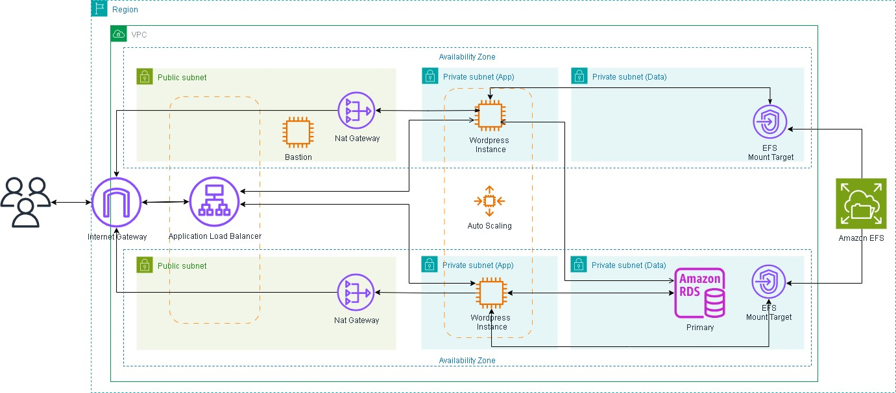

# WordPress na AWS — Infraestrutura de Alta Disponibilidade

<div style="text-align:center;">
  
</div>

## 📌 Introdução
Este projeto demonstra a implantação de uma **arquitetura escalável e altamente disponível** para hospedar um site WordPress na **AWS**.  
A infraestrutura utiliza recursos gerenciados como **EC2, RDS, EFS, Auto Scaling Group (ASG)** e **Application Load Balancer (ALB)**, todos dentro de uma **VPC customizada** com sub-redes públicas e privadas.  

---

## 🏗️ Visão Geral da Arquitetura
- **VPC customizada** com 2 sub-redes públicas e 2 privadas  
- **Internet Gateway** para saída de internet das sub-redes públicas  
- **NAT Gateway** para permitir saída de internet das sub-redes privadas
- **Security Groups** com regras restritivas, permitindo apenas comunicação essencial entre os serviços
- **Amazon RDS (MySQL)** para banco de dados gerenciado e seguro  
- **Amazon EFS** para armazenamento compartilhado dos arquivos de mídia 
- **Instâncias EC2** em containers Docker com **docker-compose**
- **Application Load Balancer (ALB)** para distribuir o tráfego entre múltiplas zonas de disponibilidade
- **Auto Scaling Group (ASG)** para ajustar automaticamente a capacidade conforme a demanda

---

## ⚙️ Passos para a Criação

### 1.1 Create VPC with subnets and NAT Gateway automatically

- Acesse o console da AWS > **VPC > Your VPCs > Create VPC**
- Selecione: ✅ **VPC and more**
- **Auto-generate**: ✅
- **Name**: `wordpress`
- **IPv4 CIDR block**: `10.0.0.0/16`
- **IPv6 CIDR block**: No IPv6
- **Tenancy**: Default
- **Number of Availability Zones (AZs)**: `2`
- **Number of public subnets**: `2`
- **Number of private subnets**: `2`
- **Gateways NAT**: selecione **1 per AZ** (um para cada AZ)
- **VPC endpoints**: None
- **Create VPC**

---

### 1.2 Create Security Groups (EC2, RDS, EFS, and LB)
- Acesse o console da AWS > **EC2 > Network & Security > Security Groups > Create security groups**

| **Security Group** | **Inbound (entradas)** | **Outbound (saídas)** | **Propósito / Observações** |
|--------------------|-------------------------|------------------------|------------------------------|
|**EC2-SG** | - SSH **22** — origem: **Seu-IP** *(Teste)* <br> - HTTP **80** — origem: **SG-ALB** <br> - NFS **2049** — origem: **EFS-SG** | - All traffic → `0.0.0.0/0` | Instâncias privadas rodando WordPress/Docker. |
|**RDS-SG** | - MySQL **3306** — origem: **SG-EC2** | - MySQL **3306** — origem: **SG-EC2** | Comunicação bidirecional com EC2. |
|**EFS-SG** | - NFS **2049** — origem: **SG-EC2** | - NFS **2049** — origem: **SG-EC2** | Comunicação bidirecional |
|**ALB-SG** | - HTTP **80** — `0.0.0.0/0` | - HTTP **80** — `0.0.0.0/0` | Redirecionar tráfego para instâncias |

---

### 1.3 – Create Database (RDS)

- Acesse o console da AWS > **RDS > Databases > Create database**
- **Choose a database creation method**: `Standard Create`
- **Engine options**: `MySQL`
- **Templates**: `Free Tier`
- **DB instance identifier**: `wordpress-rds`
- **Master username**: `admin`
- **Credentials management**: `Self managed`
- **Master password**: `Strong password`
- **Instance configuration**: `db.t3.micro`
- **Virtual private cloud (VPC)**: `wordpress-vpc`
- **Public access**: `No`
- **Existing VPC security groups**: `rds-sg`
- **Database port**: `3306`
- ✅ **Create database**

---

### 1.4 Create File System (EFS)

- Acesse o console da AWS > **EFS > Create file system > Customize**
- **Name**: `wordpress-efs`
- **File system type**: `Regional`
- **Automatic backups**: ❌ `uncheck`
- **Lifecycle management**: `All None`
- **Network access**: `Your VPC`
- **Private subnets**:
  - `wordpress-subnet-private1-us-east-1a`
  - `wordpress-subnet-private2-us-east-1b`
- **Click**: `Next two times`
- ✅ **Create**

---

### 1.4 Create Launch Template (EC2)

- Acesse o console da AWS > **EC2 > Instances > Launch Template**
- **Launch template name**: `wordpress-template`
- **description**: `Template de inicializacao`
- **Auto Scaling guidance**: ✅ `check`
- **Application and OS Images (Amazon Machine Image)**:
  - **Quick Start**: `Amazon Linux`
- **Instance type**: `t2.micro`
- **Key pair (login)**: `Your Key`(optional)
- **Network settings**:
  - **Subnet**: `Don't include in launch template`
  - **Availability Zone**: `Don't include in launch template`
- **Select existing security group**: `EC2-SG`
- **Resource tags**: `Your tags`
- **Advanced details**: `Paste Script > User data`
- ✅ **Create**

### ❗Important❗
  - Change variables

```bash
#!/bin/bash

# Variáveis
EFS_FILE_SYSTEM_ID="<id_efs>"
DB_HOST="<endpoint_rds>"
DB_NAME="<nome_bd>"
DB_USER="<usuario_bd>"
DB_PASSWORD="<senha_bd>"
PROJECT_DIR="/home/ec2-user/wordpress"
EFS_MOUNT_DIR="/mnt/efs"

# Atualizações e instalação do Docker
yum update -y
yum install -y docker

# Inicia o serviço docker
service docker start
usermod -a -G docker ec2-user

# Instala Docker Compose (versão atual recomendada)
curl -SL https://github.com/docker/compose/releases/latest/download/docker-compose-linux-x86_64 -o /usr/local/bin/docker-compose
chmod +x /usr/local/bin/docker-compose

# Instala EFS utils e monta o sistema
yum install -y amazon-efs-utils
mkdir -p ${EFS_MOUNT_DIR}
mount -t efs ${EFS_FILE_SYSTEM_ID}:/ ${EFS_MOUNT_DIR}
echo "${EFS_FILE_SYSTEM_ID}:/ ${EFS_MOUNT_DIR} efs defaults,_netdev 0 0" >> /etc/fstab

# Permissões para o EFS
mkdir -p ${EFS_MOUNT_DIR}/html
chown -R 33:33 ${EFS_MOUNT_DIR}/html
chmod -R 775 ${EFS_MOUNT_DIR}/html

# Prepara o projeto WordPress
mkdir -p ${PROJECT_DIR}
cd ${PROJECT_DIR}

# Cria docker-compose.yml
cat > docker-compose.yml <<EOL
version: '3.7'
services:
  wordpress:
    image: wordpress:latest
    container_name: wordpress
    environment:
      WORDPRESS_DB_HOST: ${DB_HOST}
      WORDPRESS_DB_NAME: ${DB_NAME}
      WORDPRESS_DB_USER: ${DB_USER}
      WORDPRESS_DB_PASSWORD: ${DB_PASSWORD}
    ports:
      - 80:80
    volumes:
      - ${EFS_MOUNT_DIR}/html:/var/www/html
EOL

# Inicia o container
docker-compose up -d
```


